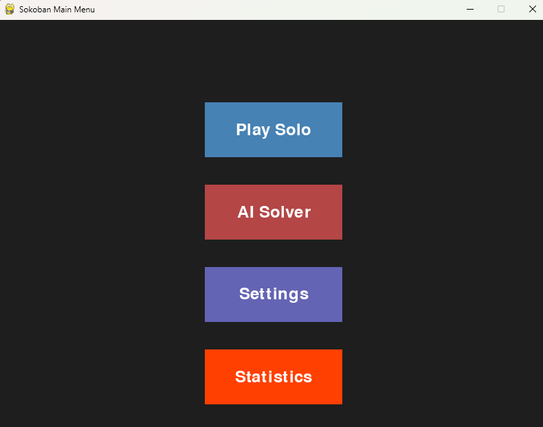
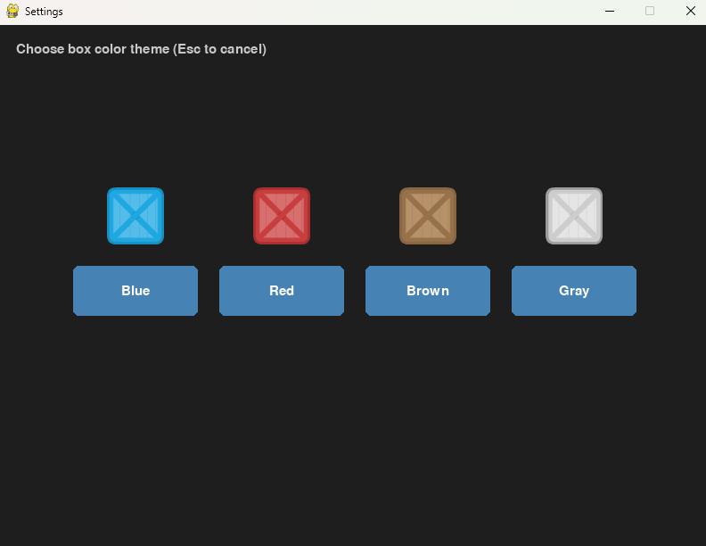
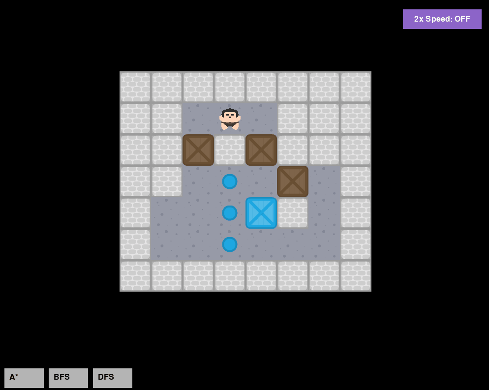
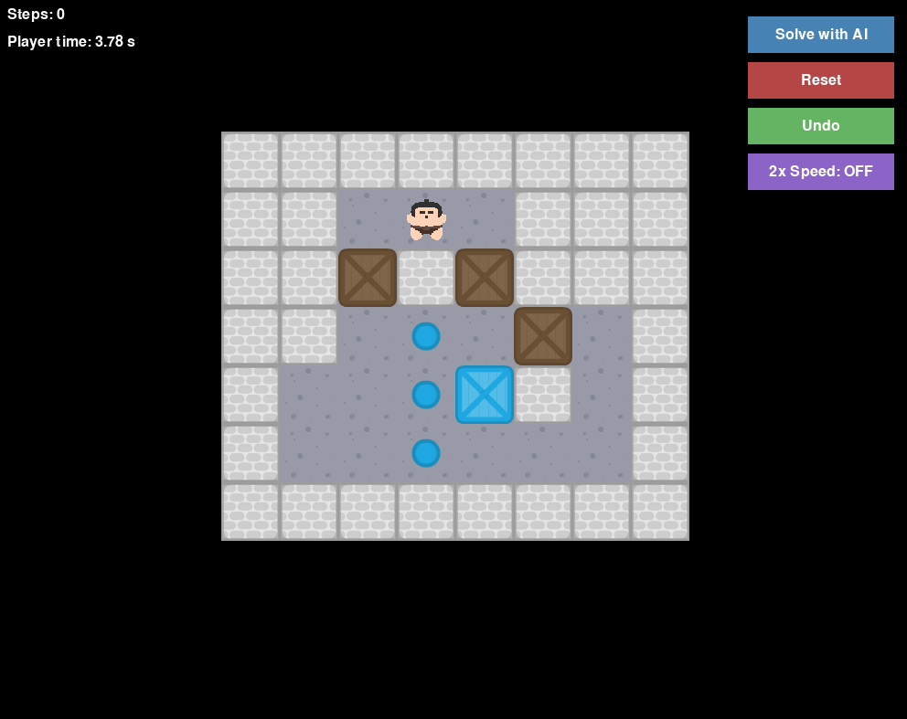

# Sokoban Solver with AI & Graphical Interface

A **Sokoban** puzzle game with both manual play and AI solvers, implemented in Python using **Pygame**.  
This project features **deadlock detection**, multiple solving algorithms (**A***, **BFS**, **DFS**), solution visualization, and customizable themes.

---

## Game Goal
Sokoban is a classic puzzle game where a player pushes boxes onto designated goal squares inside a maze.
- **Win Condition**: All boxes are placed on the goal tiles.
- **Movement Constraints**:
  - Boxes can **only be pushed**, not pulled.
  - The player cannot walk through walls or boxes.
- The challenge lies in avoiding **deadlock states** where the puzzle becomes unsolvable.
- [More about Sokoban →](https://en.wikipedia.org/wiki/Sokoban)

---

## Project Goals
- Implement **AI algorithms** capable of solving Sokoban efficiently.
- Compare solver performance using metrics such as **execution time** and **nodes explored**.
- Explore **game-specific optimizations** such as deadlock detection and heuristics.
- Provide a **graphical interface** for both manual play and solver visualization.

---

##  Features

### AI Solvers
- **A***, **BFS**, and **DFS** search algorithms.
- Performance statistics: execution time, explored nodes.
- **Heuristics**:
  - **Manhattan distance**: sum of shortest grid distances from each box to the nearest goal.
  - **Euclidean distance**: direct-line distance; faster to compute but less tight.
  - **Hungarian algorithm**: computes an optimal box-to-goal assignment to minimize total distance.

### Deadlock Detection
Deadlocks are identified **before exploring a state** to prune the search space. Implemented detectors include:
1. **Corner Deadlock** — Detects boxes stuck in a non-goal corner (two perpendicular walls).
2. **Wall Deadlock** — Identifies boxes pushed along walls into positions that cannot reach any goal.
3. **Tunnel Deadlock** — Flags boxes in narrow passages where movement is impossible unless already on a goal.
4. **Freeze Deadlock** — Detects clusters of adjacent boxes that mutually block each other from reaching any goal.
5. **Static Dead Squares** — Precomputed unreachable-from-goal positions, used to prevent placing boxes there at all.

These checks are integrated directly into the **successor generation phase**, ensuring early pruning.

---

## Technical Design

### **State Representation**
Each state is modeled as:
States are stored exactly as in the `SokobanState` class (coordinates are `(x, y)` where `x` is column and `y` is row):

```python
# Core fields
self.grid: List[List[str]]          # mutable board; characters '#', '@', '$', '.', '*', ' '
self.player: Tuple[int, int]        # (x, y)
self.boxes: Set[Tuple[int, int]]    # parsed from '$' and '*'
self.goals: Set[Tuple[int, int]]    # parsed from '.' and '*'
self.empty_spaces: Set[Tuple[int,int]]   # ' ' cells (used to precompute dead squares)
self.dead_squares: Set[Tuple[int,int]]   # computed once from layout
```

- Walls and goals are parsed from `grid` at init. Walls are queried via `is_wall(x, y)`, while `goals` are kept as a separate set and overlaid during rendering.
- Boxes are stored as a **mutable `set`**. An invariant ordering is applied **only for hashing/equality** by sorting the set, which keeps updates cheap while ensuring identical layouts hash the same.
- Player coordinates are `(x, y)`.


**Hashing** is critical for detecting revisited states efficiently:
```python
    def __hash__(self):
        # Use sorted boxes for invariant state representation
        return hash((self.player, tuple(sorted(self.boxes))))
```

### **Search Algorithm Framework**
- **BFS**: Guaranteed to find the shortest solution but memory-heavy.
- **DFS**: Memory-efficient but may get stuck in deep branches.
- **A***: Uses heuristics to prioritize promising states; best choice for large levels.

All solvers share a **push-based successor generator**:
- Compute player-reachable tiles without moving boxes.
- For each reachable adjacent box, simulate a push if the target square is free and not a dead square.
- Apply **deadlock checks** immediately after the push.

### **Heuristic Design**
1. **Manhattan Distance Sum** — lower bound on pushes required.
2. **Euclidean Distance Sum** — cheaper alternative.
3. **Hungarian Algorithm** — solves the optimal box-goal matching problem in O(n³) for tighter estimates.

The heuristics are **admissible**, ensuring **A*** finds optimal solutions.

---

## Graphics & UI
- ### Built with **Pygame**.

- ### Four themes: blue, red, brown, gray.

- ### Visual playback of AI solutions with adjustable animation speed.

- ### Manual gameplay with undo/reset and optional AI assistance.

---

##  Game Modes
1. **Manual Play** — Control the player yourself; undo mistakes.
2. **AI Solver Mode** — Watch algorithms solve the puzzle; compare speed & explored nodes.
3. **Settings Menu** — Change themes, select different levels.

---

## 📂 Project Structure
```
sokoban_solver/
├── levels/                  # Puzzle level files
├── images/                  # Theme assets and image files
├── solvers/                 # BFS, DFS, A*
├── sokoban_state.py         # State representation and utilities
├── main.py                  # Game loop and menu handling
├── menu.py                  # Displaying the Main Menu and all its features
├── level_loader.py          # Level loading and simple main functions
├── visualize.py             # AI algorithm solution representation
├── solo_game.py             # An option for playing the game solo 
├── stats_analysis.py        # Statistics provided from the AI solvers
├── state_display.py         # Provides image and grid maping for display
├── you_win.py               # Game loop and menu handling     
```

---
## ▶️ How to Run

1. **Clone the repository**
```bash
git clone https://github.com/arsandrej/Sokoban_solver.git
cd Sokoban_solver
```

2. **Install requirements**
```bash
pip install -r requirements.txt
```

3. **Run the game**
```bash
python main.py
```