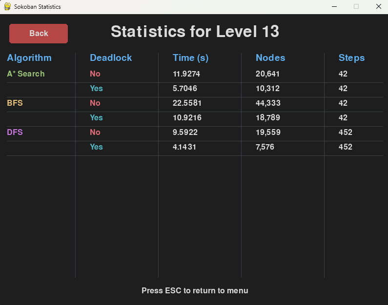

## Introduction  

Welcome to the **Sokoban Solver with AI & Graphical Interface** — a project that combines the **classic Sokoban puzzle game** with **AI search algorithms**.  
You can either play manually or watch algorithms like **A\***, **BFS**, and **DFS** solve puzzles step by step, with **deadlock detection**, **heuristics**, and **visual playback**.  

This project is designed as both a **fun game** and an **AI research tool**, offering performance statistics, customizable themes, and a graphical interface built with **Pygame**.  

---

## Table of Contents  

- [Game Goal](#game-goal)  
- [Project Goals](#project-goals)  
- [Features](#features)  
  - [AI Solvers](#ai-solvers)  
  - [Deadlock Detection](#deadlock-detection)  
- [State Representation](#state-representation)  
- [Graphics & UI](#graphics--ui)  
- [Game Modes](#game-modes)  
- [Project Structure](#project-structure)  
- [How to Run](#how-to-run)  

## Game Goal
Sokoban is a classic puzzle game where a player pushes boxes onto designated goal squares inside a maze.
- **Win Condition**: All boxes are placed on the goal tiles.
- **Movement Constraints**:
  - Boxes can **only be pushed**, not pulled.
  - The player cannot walk through walls or boxes.
- The challenge lies in avoiding **deadlock states** where the puzzle becomes unsolvable.
- [More about Sokoban →](https://en.wikipedia.org/wiki/Sokoban)

---

## Project Goals
- Implement **AI algorithms** capable of solving Sokoban efficiently.
- Compare solver performance using metrics such as **execution time** and **nodes explored**.
- Explore **game-specific optimizations** such as deadlock detection and heuristics.
- Provide a **graphical interface** for both manual play and solver visualization.

---

##  Features

### AI Solvers
- **A***, **BFS**, and **DFS** search algorithms.
- Performance statistics: execution time, explored nodes.
- **Heuristics**:
  - **Manhattan distance**: sum of shortest grid distances from each box to the nearest goal.
  - **Euclidean distance**: direct-line distance; faster to compute but less tight.
  - **Hungarian algorithm**: computes an optimal box-to-goal assignment to minimize total distance.

### Deadlock Detection
Deadlocks are identified **before exploring a state** to prune the search space. Implemented detectors include:
1. **Corner Deadlock** — Detects boxes stuck in a non-goal corner (two perpendicular walls).
2. **Wall Deadlock** — Identifies boxes pushed along walls into positions that cannot reach any goal.
3. **Tunnel Deadlock** — Flags boxes in narrow passages where movement is impossible unless already on a goal.
4. **Freeze Deadlock** — Detects clusters of adjacent boxes that mutually block each other from reaching any goal.
5. **Static Dead Squares** — Precomputed unreachable-from-goal positions, used to prevent placing boxes there at all.

These checks are integrated directly into the **successor generation phase**, ensuring early pruning.

---

## State Representation

Each game state is stored in the `SokobanState` class. The board uses `(x, y)` coordinates, where `x` is the column and `y` is the row.

- **Grid (`grid`)** – The board layout as a 2D list of characters:
  - `#` = wall  
  - `@` = player  
  - `$` = box  
  - `.` = goal  
  - `*` = box on goal  
  - `' '` = empty space
  
  Example (level1.txt)
```
#######

#.$ @ #

#######
```


- **Player (`player`)** – The player’s current position `(x, y)`.

- **Boxes (`boxes`)** – A set of coordinates for all boxes.

- **Goals (`goals`)** – A set of coordinates for all goals.

- **Empty Spaces (`empty_spaces`)** – All walkable tiles that are not walls.

- **Dead Squares (`dead_squares`)** – Tiles where a box would get stuck and make the puzzle unsolvable.

- **Hashing is critical for detecting revisited states efficiently:**
```
    def __hash__(self):
        # Use sorted boxes for invariant state representation
        return hash((self.player, tuple(sorted(self.boxes))))
```
- **Successor Generation**  
  The `get_successors()` method creates new states by moving the player or pushing a box. It has options for skipping deadlocks in case of testing.

- **Deadlock Detection**  
  Several checks (`corner`, `tunnel`, `wall`, `freeze`) are included to stop exploring impossible states early.


## Graphics & UI
- ### Built with **Pygame**.

- ### Four themes: blue, red, brown, gray.

- ### Visual playback of AI solutions with adjustable animation speed.

- ### Manual gameplay with undo/reset and optional AI assistance.

---
- ### Pre-calculated statistics per level.


---

##  Game Modes
1. **Manual Play** — Control the player yourself; undo mistakes.
2. **AI Solver Mode** — Watch algorithms solve the puzzle; compare speed & explored nodes.
3. **Settings Menu** — Change themes, select different levels.

---

## Project Structure
```
sokoban_solver/
├── levels/                  # Puzzle level files
├── images/                  # Theme assets and image files
├── solvers/                 # BFS, DFS, A*
├── sokoban_state.py         # State representation and utilities
├── main.py                  # Game loop and menu handling
├── menu.py                  # Displaying the Main Menu and all its features
├── level_loader.py          # Level loading and simple main functions
├── visualize.py             # AI algorithm solution representation
├── solo_game.py             # An option for playing the game solo 
├── stats_analysis.py        # Statistics provided from the AI solvers
├── state_display.py         # Provides image and grid maping for display
├── you_win.py               # Game loop and menu handling     
```

---
## How to Run

1. **Clone the repository**
```bash
git clone https://github.com/arsandrej/Sokoban_solver.git
cd Sokoban_solver
```

2. **Install requirements**
```bash
pip install -r requirements.txt
```

3. **Run the game**
```bash
python main.py
```